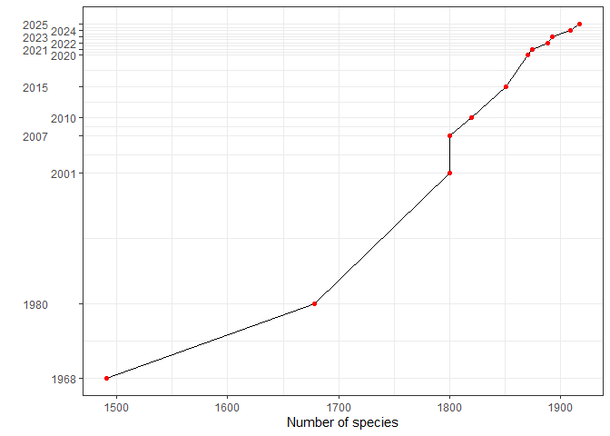

<!-- README.md is generated from README.Rmd. Please edit that file -->

# avesperu

## <a href='https://github.com/PaulESantos/avesperu'></a>

<!-- badges: start -->

[](https://lifecycle.r-lib.org/articles/stages.html#stable)
[](https://CRAN.R-project.org/package=avesperu)
[](https://github.com/PaulESantos/avesperu/actions/workflows/R-CMD-check.yaml)
[](https://cran.r-project.org/package=avesperu)
[](https://cran.r-project.org/package=avesperu)
<!-- badges: end -->

The `avesperu` package opens the door to Peru’s extraordinary birds,
encompassing a dataset of 1,901 species, highlighting its status as one
of the world’s most diverse bird-rich countries. This comprehensive R
package now leverages the meticulously updated “List of the Birds of
Peru” by M. A. Plenge, which has been revised and expanded to reflect
the latest data as of 06 - 03 - 2024. However, it’s important to
recognize that avian taxonomy is dynamic, undergoing significant changes
over time.

The species list adheres to the taxonomic classification endorsed by the
South American Checklist Committee (SACC), which assigns species codes
reflecting various aspects such as residency status, endemism, migratory
behavior, vagrancy, introductions, extirpation, and hypothetical
presence. As of now, SACC is in the process of recognizing certain
subspecies as full species, a development that will inevitably alter the
species count.

Of particular note, the “H” category, representing hypothetical species,
now holds the fifth position in South America’s ranking, following
Argentina, Bolivia, Colombia, and Ecuador. However, this ranking may
potentially decrease further with the publication of well-documented
records, underscoring the ongoing evolution and refinement of avian
taxonomy.



Suggested citation:

``` r
citation("avesperu")
#> To cite avesperu in publications use:
#> 
#>   Santos - Andrade, PE. (2023). avesperu: Access to the List of Birds
#>   Species of Peru. R package version 0.0.0.1.
#> 
#> A BibTeX entry for LaTeX users is
#> 
#>   @Manual{,
#>     title = {avesperu: Access to the List of Birds Species of Peru},
#>     author = {Paul E. Santos - Andrade},
#>     year = {2023},
#>     note = {R package version 0.0.0.1},
#>   }
#> 
#> To cite the avesperu dataset, please use: Plenge, M. A. Version
#> [07/06/2023] List of the birds of Peru / Lista de las aves del Perú.
#> Unión de Ornitólogos del Perú:
#> https://sites.google.com/site/boletinunop/checklist
```

## Installation

You can install the `avesperu` package from CRAN using:

``` r
install.packages("avesperu")
# or
pak::pak("avesperu")
```

Also you can install the development version of `avesperu` like so:

``` r
pak::pak("PaulESantos/avesperu")
```

## Usage

Here’s a quick example of how to use the `avesperu` package:

``` r
library(avesperu)
#> This is avesperu 0.0.1

splist <- c("Falco sparverius",
            "Tinamus osgodi",
            "Crypturellus sooui",
            "Thraupisa palamarum",
            "Thamnophilus praecox")

search_avesperu(splist = splist, max_distance = 0.05)
#>       name_submitted     accepted_name     english_name        spanish_name
#> 1   Falco sparverius  Falco sparverius American Kestrel Cernícalo Americano
#> 2     Tinamus osgodi   Tinamus osgoodi    Black Tinamou        Perdiz Negra
#> 3 Crypturellus sooui Crypturellus soui   Little Tinamou        Perdiz Chica
#>           order     family status dist
#> 1 Falconiformes Falconidae   nill    0
#> 2  Tinamiformes  Tinamidae   nill    1
#> 3  Tinamiformes  Tinamidae   nill    1
```

- The package not only provides access to the list of bird species
  recorded in Peru but also excels in resolving potential typos or
  variations in species names through fuzzy matching. It ensures
  accurate retrieval by intelligently recognizing and accommodating
  slight discrepancies in the input names, making it a robust tool for
  working with diverse and sometimes inconsistent datasets.

``` r
splist <- c("Falco sparverius",
            "Tinamus osgodi",
            "Crypturellus sooui",
            "Thraupisa palamarum",
            "Thraupisa palamarum",
            "Thamnophilus praecox")

search_avesperu(splist = splist, max_distance = 0.1)
#> The following names are repeated in the 'splist': Thraupisa palamarum
#>        name_submitted     accepted_name     english_name        spanish_name
#> 1    Falco sparverius  Falco sparverius American Kestrel Cernícalo Americano
#> 2      Tinamus osgodi   Tinamus osgoodi    Black Tinamou        Perdiz Negra
#> 3  Crypturellus sooui Crypturellus soui   Little Tinamou        Perdiz Chica
#> 4 Thraupisa palamarum Thraupis palmarum     Palm Tanager Tangara de Palmeras
#>           order     family status dist
#> 1 Falconiformes Falconidae   nill    0
#> 2  Tinamiformes  Tinamidae   nill    1
#> 3  Tinamiformes  Tinamidae   nill    1
#> 4 Passeriformes Thraupidae   nill    2
```
