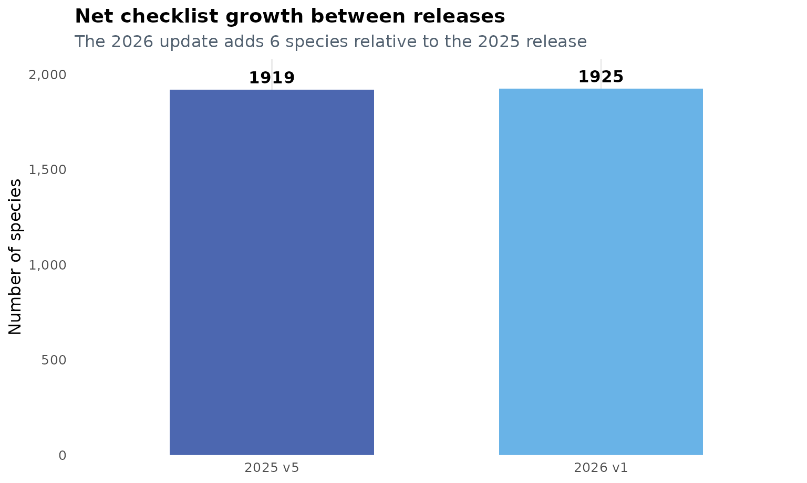
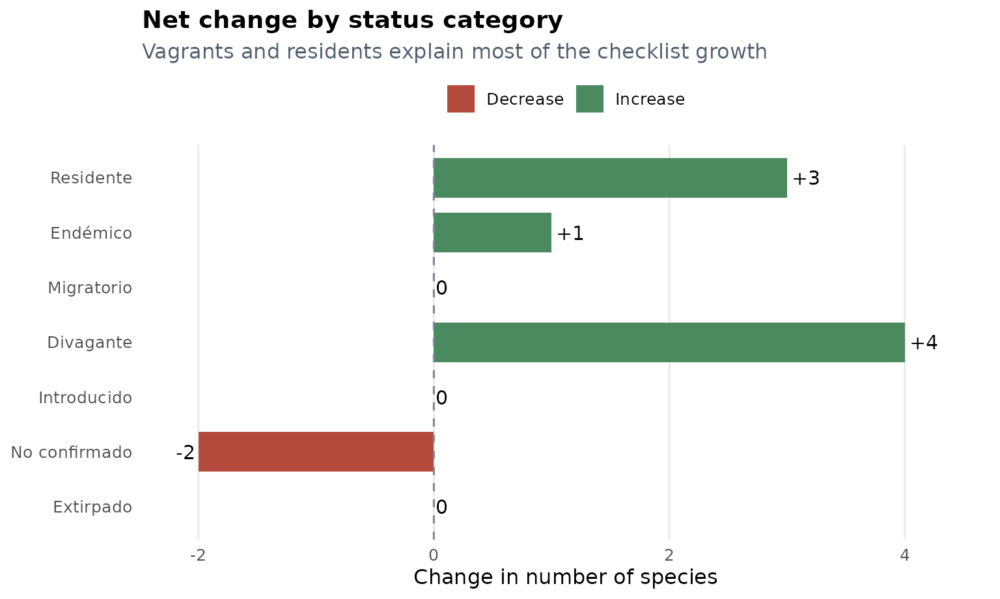
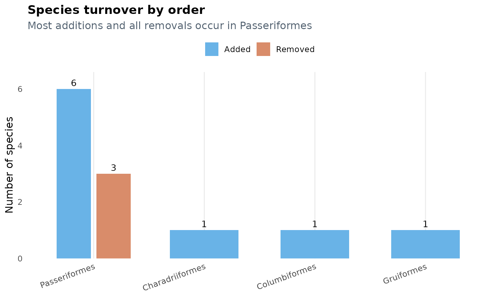
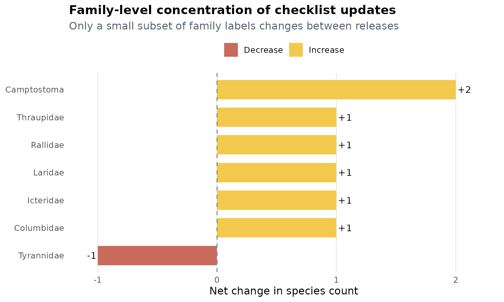

# How the Peru checklist changed from 2025 to 2026

## Introduction

This vignette compares the two most recent checklist objects shipped
with `avesperu`: `aves_peru_2025_v5` and `aves_peru_2026_v1`.

The goal is not only to show that the dataset changed, but also to
answer four practical questions:

1.  How large was the update?
2.  Which status categories changed the most?
3.  Which species entered or left the checklist?
4.  Where are the changes concentrated taxonomically?

Between 29 de diciembre de 2025 and 23 de marzo de 2026, the checklist
grew from 1919 to 1925 species. That is a net gain of 6 species.

At the same time, the overall structure of the database remained highly
stable: 1916 species are shared by both versions, which means that
99.84% of the 2025 checklist was retained in the 2026 release.

## 1. High-level snapshot

The first table summarizes the scale of the update. It shows that the
number of orders remained constant, while the number of family labels
increased slightly.

``` r

knitr::kable(summary_tbl, caption = "High-level comparison of the two checklist versions")
```

| dataset           | version_date            | species | orders | families |
|:------------------|:------------------------|--------:|-------:|---------:|
| aves_peru_2025_v5 | 29 de diciembre de 2025 |    1919 |     32 |       90 |
| aves_peru_2026_v1 | 23 de marzo de 2026     |    1925 |     32 |       91 |

High-level comparison of the two checklist versions {.table}

``` r

summary_plot_tbl <- summary_tbl
summary_plot_tbl$release <- c("2025 v5", "2026 v1")

ggplot(summary_plot_tbl, aes(x = release, y = species, fill = release)) +
  geom_col(width = 0.62, color = NA) +
  geom_text(aes(label = species), vjust = -0.5, fontface = "bold", size = 4.2) +
  scale_fill_manual(values = c("2025 v5" = "#4C67B0", "2026 v1" = "#69B3E7")) +
  scale_y_continuous(
    expand = expansion(mult = c(0, 0.08)),
    labels = scales::comma
  ) +
  labs(
    title = "Net checklist growth between releases",
    subtitle = "The 2026 update adds 6 species relative to the 2025 release",
    x = NULL,
    y = "Number of species"
  ) +
  plot_theme +
  theme(legend.position = "none")
```



This graphic is useful as a first check for reproducibility: the update
is not a complete restructuring of the package data, but a focused
revision with a small and traceable net increase.

## 2. Changes in status composition

The net increase is not distributed evenly across status categories.
Most of the change is concentrated in `Divagante`, `Residente`, and
`Endémico`, while `No confirmado` decreases.

``` r

knitr::kable(status_tbl, caption = "Species counts by status in each dataset version")
```

| status        | n_2025 | n_2026 | change |
|:--------------|-------:|-------:|-------:|
| Residente     |   1549 |   1552 |      3 |
| Endémico      |    118 |    119 |      1 |
| Migratorio    |    140 |    140 |      0 |
| Divagante     |     86 |     90 |      4 |
| Introducido   |      3 |      3 |      0 |
| No confirmado |     23 |     21 |     -2 |
| Extirpado     |      0 |      0 |      0 |

Species counts by status in each dataset version {.table}

``` r

status_plot_tbl <- status_tbl
status_plot_tbl$direction <- ifelse(status_plot_tbl$change >= 0, "Increase", "Decrease")
status_plot_tbl$label <- ifelse(
  status_plot_tbl$change > 0,
  paste0("+", status_plot_tbl$change),
  as.character(status_plot_tbl$change)
)
status_plot_tbl$status <- factor(status_plot_tbl$status, levels = rev(status_plot_tbl$status))

ggplot(status_plot_tbl, aes(x = status, y = change, fill = direction)) +
  geom_col(width = 0.72) +
  geom_hline(yintercept = 0, linetype = 2, color = "#7A8793") +
  geom_text(
    aes(
      label = label,
      hjust = ifelse(change >= 0, -0.15, 1.15)
    ),
    size = 4
  ) +
  coord_flip() +
  scale_fill_manual(values = c("Increase" = "#4B8A5F", "Decrease" = "#B34A3C")) +
  scale_y_continuous(expand = expansion(mult = c(0.08, 0.12))) +
  labs(
    title = "Net change by status category",
    subtitle = "Vagrants and residents explain most of the checklist growth",
    x = NULL,
    y = "Change in number of species"
  ) +
  plot_theme
```



Three patterns stand out:

- `Divagante` increases by 4 species, the largest category-level change
  in the update.
- `Residente` increases by 3 species, showing that the revision is not
  restricted to occasional records.
- `No confirmado` decreases by 2 species, suggesting that some
  previously uncertain records were either excluded or reclassified in
  the updated source.

## 3. Species turnover

The 2026 release adds 9 species and removes 3. Because the shared core
remains so large, the update is best understood as a targeted revision
rather than a replacement of the whole checklist.

### Added species

``` r

knitr::kable(
  added[, c("scientific_name", "english_name", "status", "family_name", "order_name")],
  caption = "Species added in aves_peru_2026_v1"
)
```

| scientific_name | english_name | status | family_name | order_name |
|:---|:---|:---|:---|:---|
| Columbina squammata | Scaled Dove | Divagante | Columbidae | Columbiformes |
| Fulica americana | American Coot | Divagante | Rallidae | Gruiformes |
| Anous stolidus | Brown Noddy | Divagante | Laridae | Charadriiformes |
| Camptostoma sclateri | Pacific Beardless-Tyrannulet | Residente | Camptostoma | Passeriformes |
| Camptostoma napaeum | Amazonian Beardless-Tyrannulet | Residente | Camptostoma | Passeriformes |
| Tunchiornis ferrugineifrons | Western Tawny-crowned Greenlet | Residente | Vireonidae | Passeriformes |
| Turdus phaeopygus | Gray-flanked Thrush | Residente | Turdidae | Passeriformes |
| Icterus spurius | Orchard Oriole | Divagante | Icteridae | Passeriformes |
| Sicalis columbiana | Orange-fronted Yellow-Finch | Residente | Thraupidae | Passeriformes |

Species added in aves_peru_2026_v1 {.table style="width:100%;"}

### Removed species

``` r

knitr::kable(
  removed[, c("scientific_name", "english_name", "status", "family_name", "order_name")],
  caption = "Species removed from the previous checklist version"
)
```

| scientific_name | english_name | status | family_name | order_name |
|:---|:---|:---|:---|:---|
| Camptostoma obsoletum | Southern Beardless-Tyrannulet | Residente | Tyrannidae | Passeriformes |
| Tunchiornis ochraceiceps | Tawny-crowned Greenlet | Residente | Vireonidae | Passeriformes |
| Turdus albicollis | White-necked Thrush | Residente | Turdidae | Passeriformes |

Species removed from the previous checklist version {.table}

Some of these additions and removals are especially informative. For
example, the replacement of `Camptostoma obsoletum` by
`Camptostoma sclateri` and `Camptostoma napaeum` is consistent with a
taxonomic split in the source checklist. Likewise, the replacement of
`Tunchiornis ochraceiceps` and `Turdus albicollis` by more specific taxa
suggests an update in species limits or taxonomic circumscription.

That interpretation is an inference from the before/after pattern in the
data, not an explicit annotation embedded in the dataset itself.

``` r

turnover_plot_tbl <- rbind(
  data.frame(order_name = turnover_by_order$order_name, movement = "Added", n = turnover_by_order$added),
  data.frame(order_name = turnover_by_order$order_name, movement = "Removed", n = turnover_by_order$removed)
)
turnover_plot_tbl <- turnover_plot_tbl[turnover_plot_tbl$n > 0, ]
turnover_plot_tbl$order_name <- factor(
  turnover_plot_tbl$order_name,
  levels = turnover_by_order$order_name[order(turnover_by_order$net_change, decreasing = TRUE)]
)

ggplot(turnover_plot_tbl, aes(x = order_name, y = n, fill = movement)) +
  geom_col(position = position_dodge(width = 0.72), width = 0.62) +
  geom_text(
    aes(label = n),
    position = position_dodge(width = 0.72),
    vjust = -0.45,
    size = 3.8
  ) +
  scale_fill_manual(values = c("Added" = "#69B3E7", "Removed" = "#D98C6A")) +
  scale_y_continuous(expand = expansion(mult = c(0, 0.1))) +
  labs(
    title = "Species turnover by order",
    subtitle = "Most additions and all removals occur in Passeriformes",
    x = NULL,
    y = "Number of species"
  ) +
  plot_theme +
  theme(axis.text.x = element_text(angle = 20, hjust = 1))
```



This plot shows that turnover is concentrated in `Passeriformes`, which
accounts for 6 of the 9 additions and all 3 removals.

## 4. Where the taxonomic changes are concentrated

At a broad level, the checklist still contains 32 orders in both
versions. The family layer changes more subtly, from 90 to 91 distinct
family labels.

The next table isolates only the family labels whose counts changed.

``` r

knitr::kable(
  family_delta,
  caption = "Families with non-zero net change between versions"
)
```

|     | family_name | n_2025 | n_2026 | change |
|:----|:------------|-------:|-------:|-------:|
| 89  | Tyrannidae  |    251 |    250 |     -1 |
| 19  | Columbidae  |     30 |     31 |      1 |
| 39  | Icteridae   |     34 |     35 |      1 |
| 41  | Laridae     |     30 |     31 |      1 |
| 68  | Rallidae    |     30 |     31 |      1 |
| 81  | Thraupidae  |    193 |    194 |      1 |
| 11  | Camptostoma |      0 |      2 |      2 |

Families with non-zero net change between versions {.table}

``` r

family_plot_tbl <- family_delta
family_plot_tbl$direction <- ifelse(family_plot_tbl$change > 0, "Increase", "Decrease")
family_plot_tbl$label <- ifelse(
  family_plot_tbl$change > 0,
  paste0("+", family_plot_tbl$change),
  as.character(family_plot_tbl$change)
)
family_plot_tbl$family_name <- factor(
  family_plot_tbl$family_name,
  levels = family_plot_tbl$family_name
)

ggplot(family_plot_tbl, aes(x = family_name, y = change, fill = direction)) +
  geom_col(width = 0.7) +
  geom_hline(yintercept = 0, linetype = 2, color = "#7A8793") +
  geom_text(
    aes(
      label = label,
      hjust = ifelse(change > 0, -0.12, 1.12)
    ),
    size = 3.8
  ) +
  coord_flip() +
  scale_fill_manual(values = c("Increase" = "#F3C94D", "Decrease" = "#C96B5C")) +
  scale_y_continuous(expand = expansion(mult = c(0.08, 0.12))) +
  labs(
    title = "Family-level concentration of checklist updates",
    subtitle = "Only a small subset of family labels changes between releases",
    x = NULL,
    y = "Net change in species count"
  ) +
  plot_theme
```



Two practical takeaways emerge from this comparison:

- Most families do not change at all, which helps preserve compatibility
  with analyses built on the previous release.
- The largest localized revision occurs around the `Camptostoma` label,
  while several other families gain a single species.

## 5. What this means for users

For most workflows, the 2026 update is a refinement rather than a
disruptive schema change. The implications are straightforward:

- If you are reproducing an analysis built with `aves_peru_2025_v5`,
  most names remain unchanged and directly comparable.
- If your data include any of the removed species, you should re-run
  matching with
  [`search_avesperu()`](https://paulesantos.github.io/avesperu/reference/search_avesperu.md)
  to align them with the current checklist.
- If you work with vagrants, endemics, or recent country records, the
  2026 release is especially relevant because these are the categories
  with the most visible shifts.

In short, `aves_peru_2026_v1` preserves continuity with the previous
checklist while incorporating a small but meaningful set of taxonomic
and occurrence updates.
